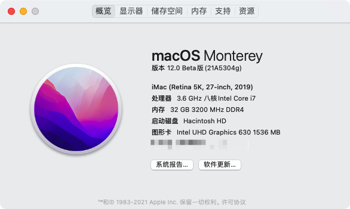

# ROG-Z390-F-GAMING-EFI
Hackintosh EFI

|  规格   | 详细信息  |
|  :----:  | :----:  |
| CPU  | Intel 9700K |
| 显卡  | UHD 630(独显买不到) |
| 主板  | [ROG Z390-F GAMING](https://rog.asus.com.cn/motherboards/rog-strix/rog-strix-z390-f-gaming-model/) |
| 内存  | [芝奇皇家戟 3200 8G*4](https://www.gskill.com/tw/product//203/300/1552463366/F4-3200C16D-16GTRS) |
| 电源  | [振华850 SUPER FLOW](https://item.jd.com/100008555706.html) |
| 硬盘  | [SN750 500G*2](https://item.jd.com/100003226990.html) |
| 网卡  | [BCM94360CD](https://item.jd.com/10021401339167.html) |
| OS版本  | 12.0 Beta |
| OC版本  | 0.7.2 |

